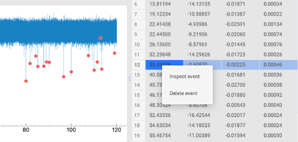
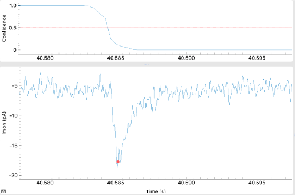

# Analyze a recording using the GUI

## Running the analysis

To analyze a loaded recording, click on the **Analyze** button. Analysis settings (e.g., model, event direction, or event length) can be adjusted in the **Settings** menu. 

After clicking the **Analyze** button, the miniML analysis will process the recording and a progress bar will be displayed. 
 
```{hint}
Runtime will depend on the size of the recording and the selected event length (default=600), as well as the CPU or GPU configuration.
```

## Inspecting the results

When the miniML analysis of the recording has finished, the results will be displayed in the GUI. Detected events are marked by red dots in the main plot window. The event plots at the bottom display the detected events, their average, and the amplitude histogram. At the top, the corresponding model prediction is shown.


In the plot windows, dragging with the left mouse button draws a box over a region of the scene that is expanded after the button is released. The **A** symbol in the bottom left corner autoscales the entire scene. Right-clicking allows further customization of the plots and exporting the data or saving the plot as a figure. Please refer to the *pyqtgraph* [documentation](https://pyqtgraph.readthedocs.io/en/latest/user_guide/) for more details.

For convenience, plots and event table can be hidden using the **Prediction**, **Event graphs**, and **Event table** buttons that toggle the display of these items.

## Event inspection and deletion

In the event table, individual events can be right-clicked to either inspect the event in the main plot windows or delete the event from the analysis.



Inspecting the event will show the selected event in the main plot window on a shorter time scale. 



Deleting an event will remove it from the analysis and update all plots.
