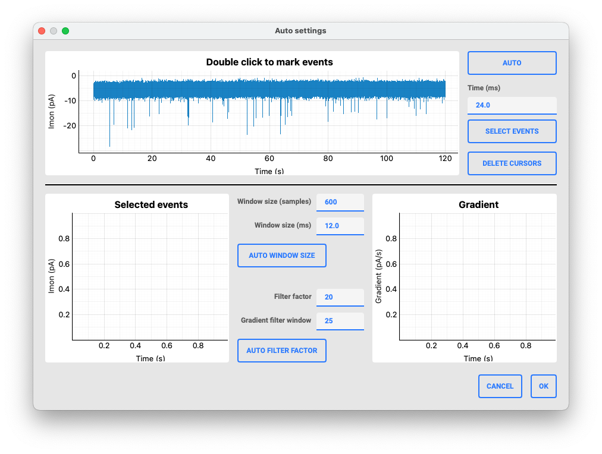
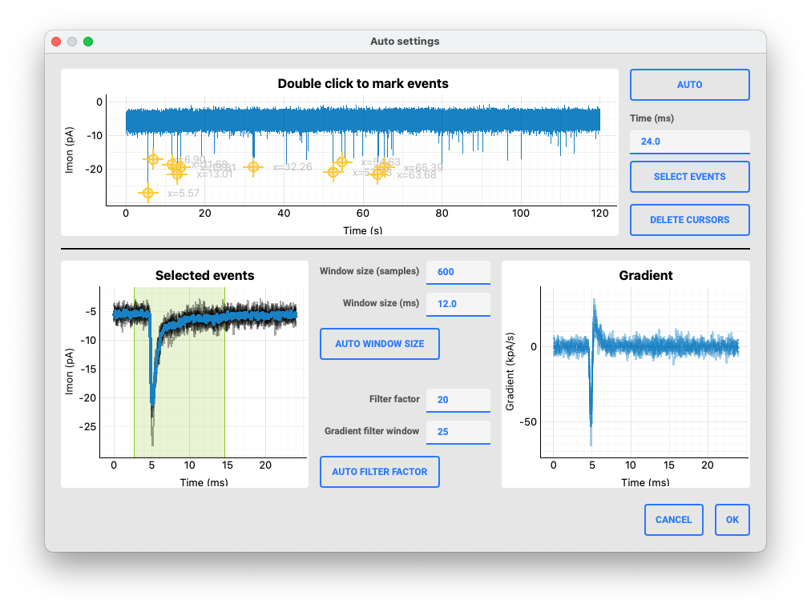

# miniML Auto Settings Tool

The Auto Settings menu allows to determine settings for using the miniML base model for event detection in your data. The tool will analyze the data and suggest optimal settings for event detection.



## Event selection
The first step is to select the events of interest in the data. The *AUTO* button will try to automatically select the 10 largest events in the data. You can also manually select the events by double-clicking on events in the data trace.

```{important}
When selecting events in the data trace, make sure to select the peak of events. The cursor can also be moved to improve the position of the event peak.
```

Upon selection of one or mulitple events, please adjsut the Time Range to include the entire event. The default is 24 ms, but this may have to be increased depending on the kinetics of the events. The time range is used to cut out event data stretches for setting the parameters of the event detection. Afterwards, click the *SELECT EVENTS* button to confirm the selection.




## Settings
The second step is to adjust the settings for the event detection. Selected events are displayed and averaged, and the default window_size is highlighted in the data trace. The window size can be adjusted to include the entire event, and the default value is 600 samples or 12 ms. Either enter a value in the input field or use mouse to adjust the ares in the plot window. Note that the start/end of the event window are automatically adjusted to the event peak position. 

```{tip}
You can use the *AUTO WINDOW SIZE* button to suggest an optimal window size. This will determine the length of the event and test different wndow sizes based on the event kinetics. The optimal window size is detemrined based on the highes miniML score and is then displayed in the input field.
```

## Filter optimization
The third step is to optimize the filter settings for the event detection. The filter settings are used to determine the event location and peak location in the data. The default values are set to 20 samples for the filter factor and 25 for the gradient filter window. First, the raw data is filtered using a lowpass Butterworth forward-backward filter with the specified filter factor (i.e., the cutoff frequency of the lowpass is sest to (sampling rate)/(filter factor)). The gradient of filtered data is then calculated and f filtered using a Hann window with the specified window size (in smaples). The final filtered data is then used to determine the event location and peak location. The filtered gradient should show a clear peak at the event location, and the peak should be well separated from the noise.

```{important}
Setting the filter parameters is critical for appropriate event quantification.
```

```{tip}
You can use the *AUTO FILTER* button to suggest optimal filter settings. This will determine the filter factor and gradient filter window based on the signal-to-noise ratio of the data. The optimal filter settings are then displayed in the input fields.
```

## Confirming selected settings
Click *OK* to confirm the selected settings. The miniML settings will be updated and the event detection can then be performed using the selected settings. 
