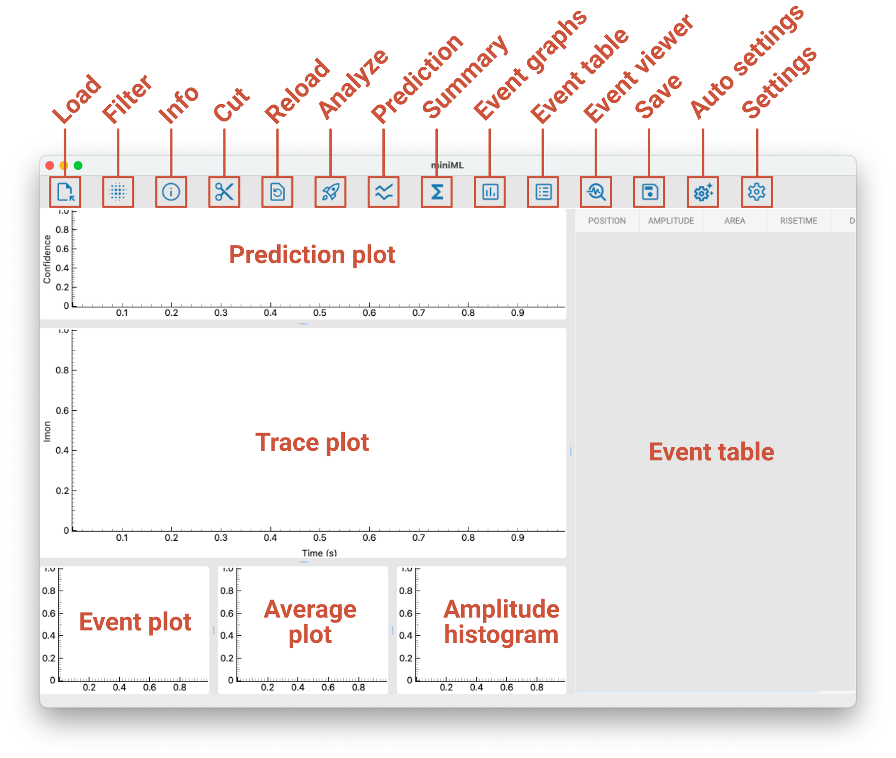
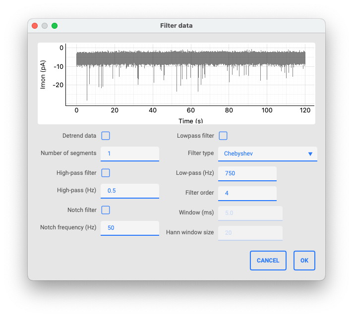
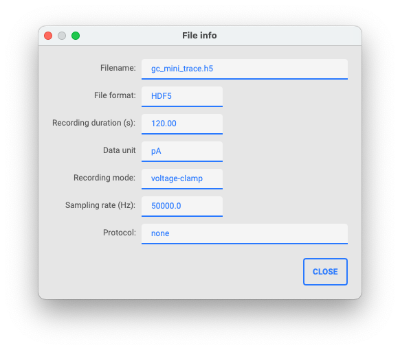
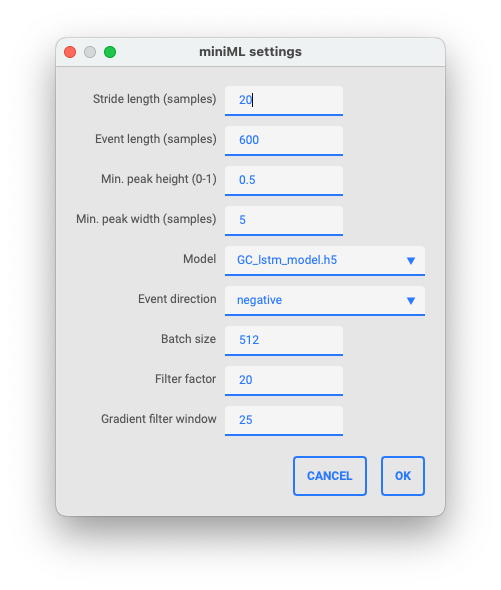

# Using the GUI

The GUI includes a toolbar and several windows:



## The toolbar

### Load

Load a new recording. Accepts .h5, .abf, and .dat files.

### Filter

Apply a filter to the recording. Includes options to detrend the data, filter the data using high-pass or low-pass filters, and apply a notch filter.



### Info

Display information about the trace and file.



### Cut

Cut data from the current recording at either the start or end of the trace.

### Reload

Reload the current recording.

### Analyze

Run the miniML analysis on the current recording.

### Prediction

Toggle display of the prediction plot.

### Summary

Show summary statistics for the analyzed recording.

### Event graphs

Toggle display of the event graphs.

### Event table

Toggle display of the event table.

### Save

Save results to file (as .csv, .h5, .pickle).

### Settings

Opens the settings menu.

```{tip}
The default values of the settings can be changed in the miniml_settings.py file.
```




## Plot windows

### Prediction plot

Here, the model inference trace is shown after analysis.

### Trace plot

This is the main plot window. It shows the recording and the detected events overlaid (after analysis).

### Event plot window

Shows all detected events overlaid.

### Average plot window

This window displays the average event waveform after analysis.

### Amplitude histogram window

This window shows the histogram of event amplitudes for the analyzed recording.

## Event table

This table lists all detected events with their location (in seconds), amplitude (in data y units), area (in data y units x seconds), risetime (in seconds), and decaytime (in seconds). Individual events can be right-clicked to either inspect the event in the main plot windows or delete the event from the analysis.
