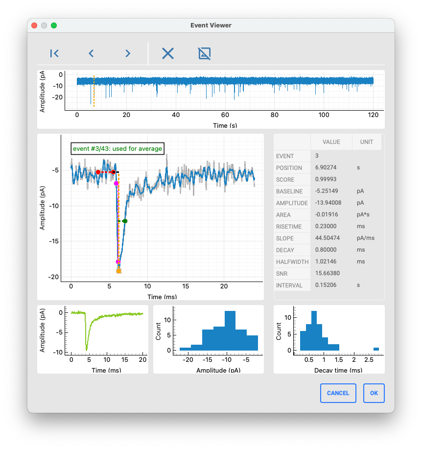

# The EventViewer

## Overview

The EventViewer window is used to inspect and delete events. 



## Using the EventViewer

The toolbar allows switching between events (alternativelay, use the left and right keyboard keys). The position of the selected event is highlighted in the raw data trace at the top.

The event plot shows the selected event in detail (gray: raw data; blue: filtered data using the filter settings in the main window). The baseline is marked in red, the event peak in orange, the rise time in magenta, and the 50% decay in green. The event statistics are displayed in the table next to the event plot.

At the bottom, the event average, amplitude histogram and decay time histogram are displayed. These plots are updated when events are either deleted (via the toolbar or by pressing the `M` key), or excluded from average calculation (via the toolbar or by pressing the `N` key).

Upon pressing OK, any event exlusions are saved and applied to the main window.

```{important}
When no event is left to calculate the average, all events are used instead to obtain an average decay time constant.
```

