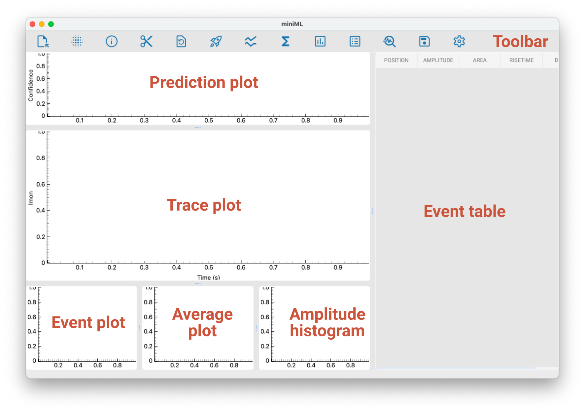

# Intro to miniML GUI

miniML can be run in a graphical user interface (GUI). The GUI provides a user-friendly interface for loading data, applying filters, and analyzing recordings.

## Installation

To use the graphical user interface of miniML, install the additional dependencies from the requirements_gui.txt file. The additional dependencies are:
- PyQt5
- qt-material
- pyqtgraph.

## Starting the GUI

Run the `miniML_gui.py` file in the miniML core folder. This will initiate the GUI.

## Getting started

The GUI includes a toolbar with icons for various tasks, plot windows, and an event table.

