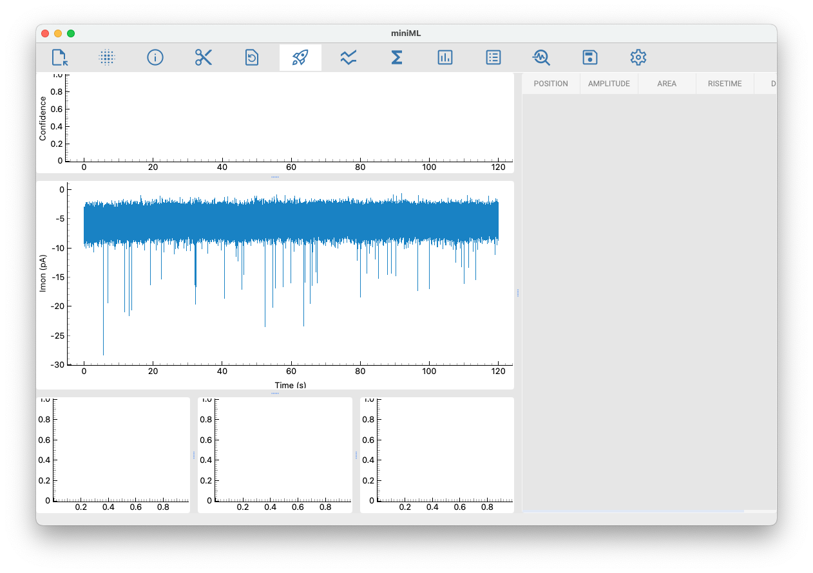

# Loading data using the GUI

## File formats

Currently accepted file formats are HDF5, Axon ABF and HEKA DAT.

## Loading data

Click on the **Load** button to load data from a file. After selecting a file in the file dialog, the following information is required:

### HFD5 files

- **Dataset name**: name of the dataset in the HDF5 file
- **Sampling interval**: sampling interval of the data in seconds
- **Scaling factor**: scaling factor of the data
- **Data unit**: y unit of the data

### ABF files

- **Recording channel**: channel of the ABF file to load data from
- **Scaling factor**: scaling factor of the data
- **Data unit**: y unit of the data
- **Protocol**: displays the recording procol (optional)

### DAT files

- **Import group**: the group level of the DAT file to load data from
- **Import series**: the series level of the DAT file to load data from
- **Import all series of this type**: toggle to import all series of this recording (PGF) type
- **Exclude selected series**: List of series to exlcude (optional)
- **Scaling factor**: scaling factor of the data
- **Data unit**: y unit of the data

## Successful loading

The miniML window will display the trace after loading from file:

Now you can pre-process the data (e.g., apply filters), adjust the analysis settings, and proceed with the analysis by clicking the **Analyze** button.
