# miniML model training

Training a new miniML model generally requires the following steps:
- Identify the correct window size for your data
- Extracting training data
- Scoring the training data
- Model training (either full training or re-training via transfer learning)
- Use the new model: List of the parameters that may need to be adjusted

All the files and links to train your own model are provided in the GitHub repository. This documentation will show you how to use them and guide you through the process of training your own model, and apply it to your data, step by step. For the steps that have a corresponding file on GitHub, the directory and filename are indicated.


## Selecting a window size

miniML is a classifier that predicts whether a given data stretch contains a synaptic event or not. For good classification performance, the stretch of data must be large enough to contain the entire event. In the case of our recordings in cerebellar granule cells, this corresponds to 600 data points (samples) or about 12 ms given a sampling rate of 50 kHz (see figure below).

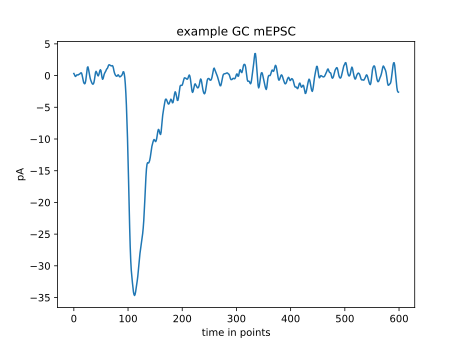

If event kinetics and/or sampling rate are different in other data, 600 points may be too much or too little. For example, to capture a synaptic event in current clamp in the same cell, the window size needs to be expanded to 3000 points. Because the model expects an input size of 600 points, we resample the trace based on the provided window size for inference. For example, the window size is set to 3000 points, and a recording containing 6,000,000 points is provided. In this case, we can down-sample the whole trace by a factor of 5, to 1,200,000 points. Now the signal of interest fits into the 600-point window that the model expects (see figure below). This only concerns the prediction by the model. To analyze the detected events, e.g., to read out amplitudes, the original recording is used again. To give an idea what window sizes we chose, in the following there are a few examples from different preparations used in the manuscript. Red dotted lines indicate the 600-point window that is classified by the model.

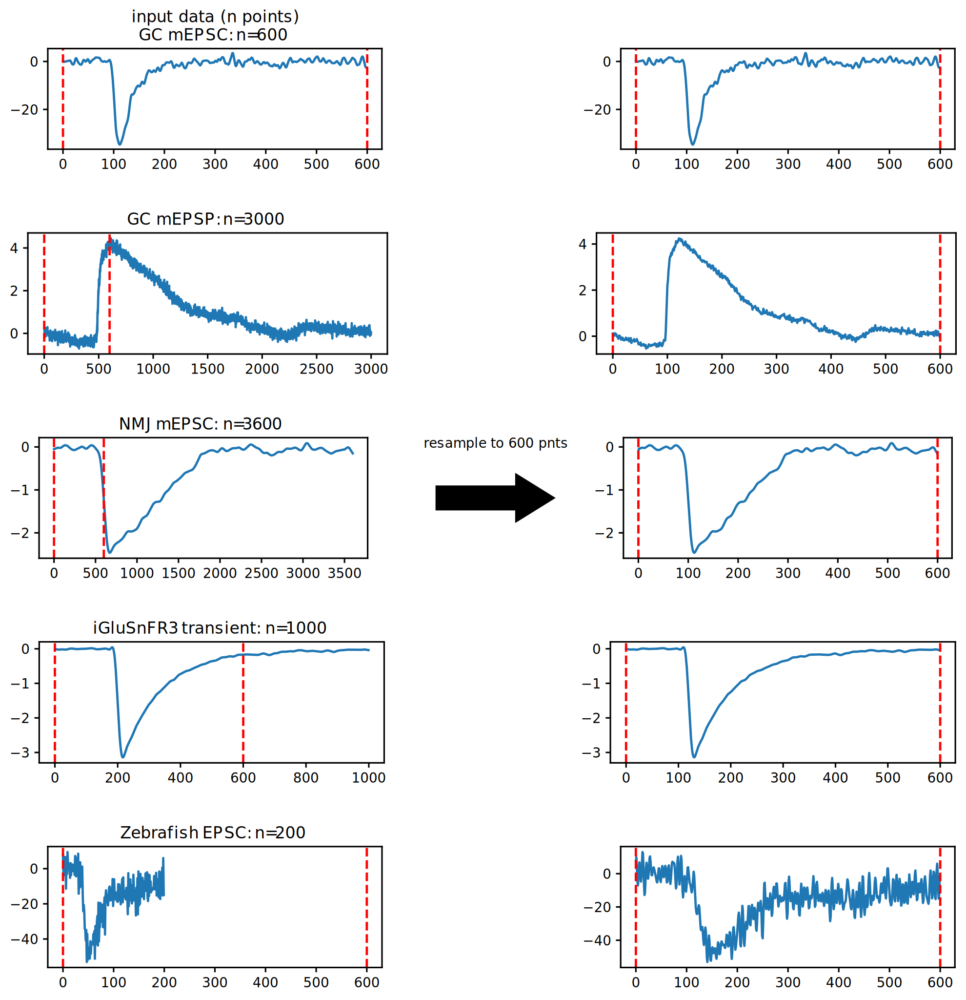

If our model does not perform well in your data, this could be a reason and simply adjusting the window size and resampling the data may help. This is especially the case if the event kinetics or even the cell type is the same, but a different sampling rate was used during the recordings. However, if the overall shape of the event and the noise characteristics are too different, it may be necessary to train a new model. This is explained in the following.

## Extracting training data

After identifying the proper window size, we need compile a training dataset. We extract training data with an implementation of template matching, which worked well in our hands. However, any method that can extract short data stretches as shown below is suitable. A good training dataset should contain:

- Clear examples of synaptic events:
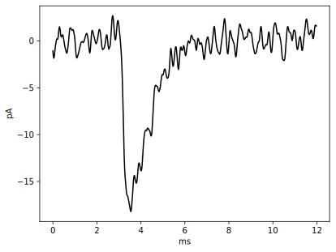

- Examples of synaptic events that are “less nice”, e.g. because they are smaller in amplitude and have a limited signal to noise ratio:
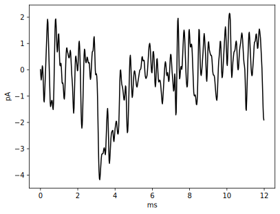

- Negative examples of signals that may resemble a synaptic event but would be considered a false positive.
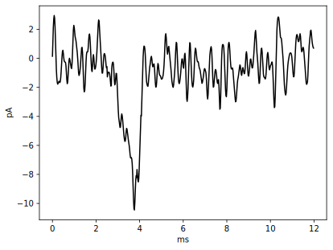

- Negative examples that contain purely noise (as far as it’s possible to judge):
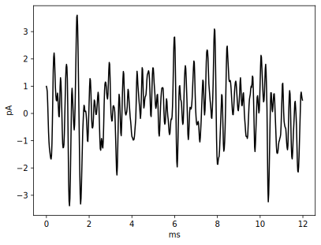


```{note}
It should be noted that the criteria of what is or is not a synaptic event will depend on the preparation and recording conditions. We do not claim that the examples used here are representative for all situations.
```

The dataset should be balanced, i.e., the ratio of positive and negative examples should be close to one. Additionally, we recommend including examples from multiple recordings to help the model generalize. To extract training data, we use template matching, but any method that provides data stretches as shown above works. An advantage of template matching is the possibility to control how many false positives are picked up by adjusting the threshold. For each provided recording, template matching can be used to:
- Extract clear positive examples by using a relatively high threshold.
- Extract clear negative examples by using a very low threshold, and extracting noise stretches from whatever data is left.
- Extract “less nice” events, that may typically be missed and false positives that can get picked up by using an intermediate threshold.

We estimate all parameters of template matching based on the provided window size. This usually works well enough, but parameters may need to be further adjusted if events are systematically missed (for example if there are two different inputs with very different event shapes).

## Scoring training data

Once extracted, the training data needs to be scored manually. We provide a script that allows scoring of a training dataset using mouse and keyboard. The scores for any given stretch of data should either be 1 (is a synaptic event) or 0 (is not a synaptic event). We added the option to give a data stretch the score 2. This allows to mark events that need to be excluded, e.g., because it is not clear how to score it, because it is a duplicate, etc. They have to be excluded later for the actual training, however.

Scoring the training data is arguably the most important step in the entire workflow. How well the model performs largely depends on the training data, and it is worth spending some time on curating it.

```{note}
As mentioned above, a good training dataset contains clear events with good signal-to-noise ratio, smaller more “messy” events, false positives that may be picked up and pure noise. Given that we want to keep the ratio of positive and negative scores around one, that means that we can modify our dataset by changing the ratio of nice events to more messy events and the ratio of false positives to pure noise. In our experience, including more messy events will lead to less restrictive models that will more readily classify data as being an event. Conversely, increasing the number of false positives in the training data leads to more restrictive models.
```

To give a practical example, one could generate a training dataset that contains 100 nice events and 500 not so nice events with score “1” as well as 50 false positives and 550 pure nose stretches with score “0”. This model will likely be quite liberal with what it accepts as an event and may pick up false positives. If that is the case, one can start playing around with the two ratios. For example, one could include 300 nice events, 300 not so nice events and leave the negative scores as above. We would expect the new model to be more restrictive than the previous one. If it still picks up false positives, one can continue to change these ratios and, in the end, choose the model that seems to work best for the data in question. A toy example of such a process is summarized in the table below.

| nice events | not so nice events | false positives | pure noise | Expected performance |
| ----------- | ----------- | ----------- | ----------- | ----------- | 
| 100 | 500 | 50 | 50 | Liberal model | 
| 300 | 300 | 50 | 550 | More restrictive | 
| 300 | 300 | 300 | 300 | Intermediate | 
| 300 | 300 | 500 | 100 | Restrictive Model | 

## Training a model

We use cloud services by Kaggle to train our models. Kaggle is an online data science community platform owned by Google that allows using a GPU to train machine learning models. For GPU use, verification via a phone number is required by Kaggle. If you prefer not to or cannot register a phone number, models can also be trained without GPU use (about 80s for a transfer learning dataset containing 1000 entries). Of course, you can also train models locally on your computer using the code in the Jupyter notebooks provided on Kaggle. With the following links you will find a script to train a model using transfer learning, a script to train a model from scratch and a Kaggle dataset. The Kaggle dataset contains mEPSC training data from cerebellar granule cells, the model we trained with it, and a smaller mEPSP training dataset also from cerebellar GCs:

[Transfer learning](https://www.kaggle.com/code/philipponeill/miniml-transfer-learning)

[Full training](https://www.kaggle.com/code/philipponeill/miniml-full-training)

[The dataset](https://www.kaggle.com/datasets/philipponeill/miniml-training-data)

To train a model, the previously scored dataset needs to be uploaded to a Kaggle dataset. To train a model from scratch, uploading the dataset and running the from-scratch script should suffice. For transfer learning, additionally a base model is needed. We provide one such model (GC_lstm_model.h5) in the Kaggle dataset. After training, the best fitting model (lstm_transfer.h5) can be downloaded from the Output directory:
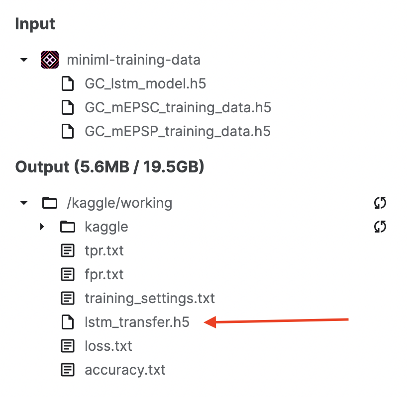


## Using a new model on your data

Once downloaded, the new model can readily be applied with the following adjustments:

### Set new model path

To use another model, we need to change the *model_path* to the path of the new model.

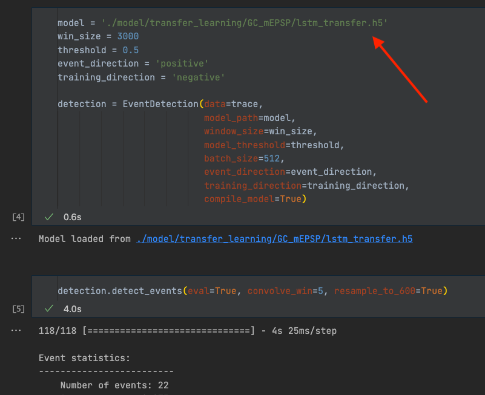

### Set new window size

If the new model has a different window size, we need to change the *win_size* parameter.

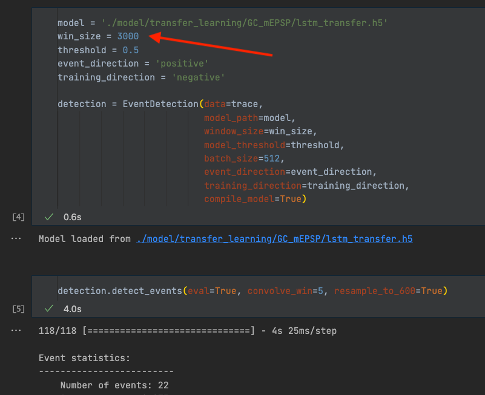

### Define event direction and training direction

Every model requires defining *event_direction* and *training_direction*. Both can be ‘positive’ or ‘negative’, and default to ‘negative’. There are two separate parameters, because the direction during training may not correspond to the direction in actual data. This is usually the case when training a TL model for positive events, such as mEPSPs from cerebellar granule cells. Inverting the mEPSPs during TL improved model performance, presumably because the events are more similar to the negative mEPSCs the base model was trained on. In that case, the raw data needs to be inverted for inference, but not for downstream analysis. Keep this in mind and make sure the parameters are set appropriately, otherwise the prediction or the downstream analysis will not work properly

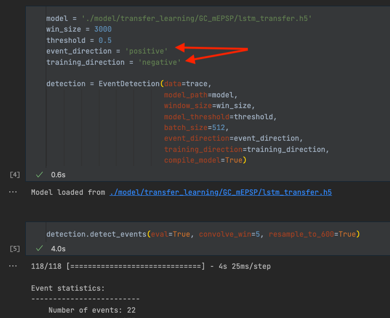

### Adjust filter window size

To analyze the detected events, we identify an event location (point of steepest rise) using the first derivative. Based on that, we find peak position, onset position etc. to read out quantitative values such as the event amplitude. Additionally, we use this approach to identify overlapping events (see below). To find event locations and other points of interest we first need to filter the data. We use a Hann window for that purpose. In our hands, using a Hann window allowed us to filter the data and remove noise peaks without distorting event kinetics too much. *convolve_win* is the only parameter that needs to be adjusted. *convolve_win* is the size of the Hann window (not to be confused with the window size, win_size, used for inference). While it does not affect the detection itself, it is important for the downstream analysis of the events. Filtering the data too little can lead to noise peaks being detected as event location, peak, onset, etc. Conversely, filtering the data too much can lead to heavily distorted event kinetics and a decrease in absolute signal amplitude, and therefore lead to slower kinetics and lower amplitudes.

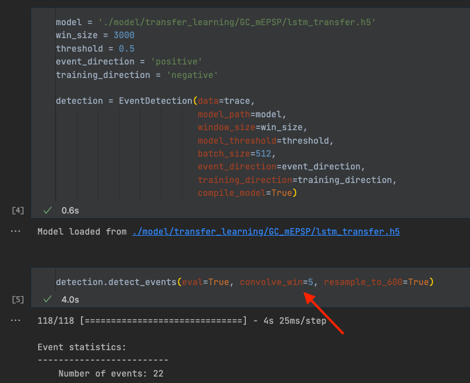


We include two examples here of an event being filtered too much (*convolve_win* = 150) or too little (*convolve_win* = 3). In the two examples below, the middle column (*convolve_win* = 20) would be a good filter setting. The second example also shows how overlapping events are being detected.

Example 1:

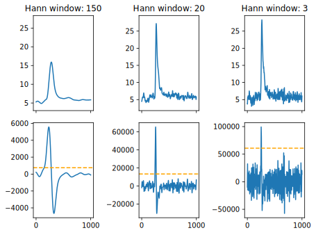


Example 2:

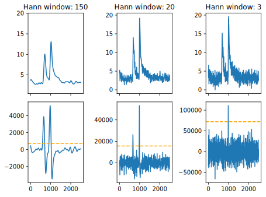

### Set the resample flag

*resample_to_600* is a Boolean flag (set to True/False). If True, the data gets resampled based on the window size. See also section 1, “select a window size”. For transfer learning this will always be **True**. If you train a model from scratch with a window size different from 600, this needs to be set to **False**.

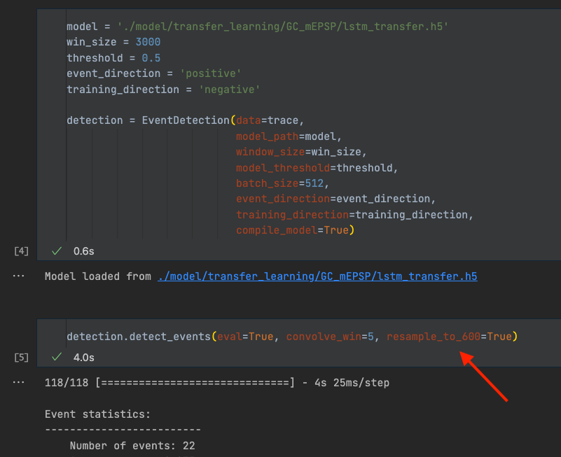


## Sharing of trained models

If you do train a new model for your favorite preparation, and you are happy with the model performance, feel free to share it with the community. You can either create a pull request on GitHub, or get in touch via email to provide the model to other scientists.
